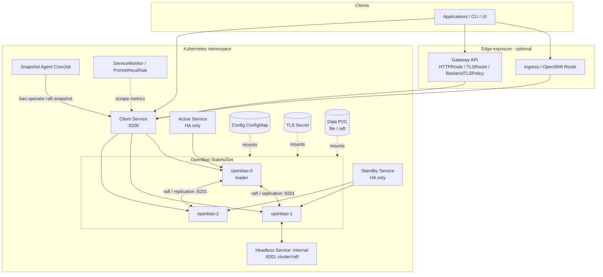

[[_TOC_]]

# Overview

OpenBao is an open-source fork of HashiCorp Vault: an identity-based secrets and
encryption management system. It provides encryption services gated by
authentication and authorization methods, so that applications, machines and
users can securely store and tightly control access to tokens, passwords,
certificates and encryption keys.

This Helm chart packages the OpenBao server for Kubernetes and OpenShift. It is
a Netcracker/Qubership distribution of the upstream
[`openbao/openbao-helm`](https://github.com/openbao/openbao-helm) chart.

Key capabilities:
- **Secrets management** — store and dynamically generate secrets (databases,
  PKI, cloud credentials, etc.).
- **Encryption as a service** — encrypt/decrypt data without storing it.
- **Multiple deployment topologies** — from a throwaway dev server to
  a highly-available cluster backed by integrated Raft or Consul.
- **End-to-end TLS** — server listener, cluster/replication traffic, probes,
  metrics scraping and backups can all run over TLS (see
  [Configuration](/docs/configuration.md)).
- **Kubernetes-native integration** — service registration, Kubernetes auth
  delegation, Gateway API / Ingress / OpenShift Route exposure, Prometheus
  telemetry and scheduled Raft snapshots.

> **Distribution note.** Unlike upstream, this distribution does **not** deploy
> the Agent Injector or the Secrets Store CSI provider. Those templates are kept
> under `not-relevant/` and are not rendered. The shipped default is **dev
> mode** (`server.dev_mode.enabled: true`), which is only suitable for
> experimentation.

# Architecture schema

# Deployment modes

The deployment topology is not set directly; it is derived by the `openbao.mode`
helper (`charts/openbao/templates/_helpers.tpl`) from the switches below,
evaluated in this precedence order:

| Mode | Trigger (`values.yaml`) | Description |
|------|-------------------------|-------------|
| `external` | `global.externalBaoAddr` set, or `server.enabled: false` | No OpenBao server is deployed. Other resources point at an external OpenBao address. |
| `ha` | `server.ha.enabled: true` | Highly-available multi-replica cluster (`server.ha.replicas`, default `3`). Storage backend is **Consul** by default (`server.ha.config`) or **integrated Raft** when `server.ha.raft.enabled: true` (`server.ha.raft.config`). |
| `standalone` | `server.standalone.enabled: true` or `"-"` (default when nothing else selected) | Single-replica, non-HA server using the `file` storage backend at `/openbao/data`. Should not be scaled past one replica. |
| `dev` | `server.dev_mode.enabled: true` (**shipped default**) | Dev server. No init/unseal; uses a static unseal-key secret (`bao-static-unseal-key`). **All data is lost on restart** — experimentation only. |

- Replica count is resolved by `openbao.replicas`: `1` for `standalone`/`dev`,
  `server.ha.replicas` (default `3`) for `ha`.
- The server HCL config is selected per mode by `openbao.config`:
  `server.standalone.config`, `server.ha.raft.config`, or `server.ha.config`.

# Components

The chart deploys the following Kubernetes resources
(`charts/openbao/templates/`), grouped by purpose.

### Server core
- **StatefulSet** (`server-statefulset.yaml`) — the OpenBao server pods.
- **Config ConfigMap** (`server-config-configmap.yaml`) — the rendered server
  HCL config (listener, storage, optional seal/telemetry).
- **ServiceAccount** (`server-serviceaccount.yaml`,
  `server-serviceaccount-secret.yaml`) — identity for the pods, with an optional
  non-expiring token secret.
- **Dev token Secret** (`server-dev-token.yaml`) — static unseal key
  (`bao-static-unseal-key`) used only in dev mode.
- **PodDisruptionBudget** (`server-disruptionbudget.yaml`) — availability during
  voluntary disruptions (HA).
- **Persistent Volume Claims** — created from `server.dataStorage` and
  `server.auditStorage`.

### Services
- **Client Service** (`server-service.yaml`) — main client entry point, port
  `8200`.
- **Headless Service** (`server-headless-service.yaml`) — `-internal` service
  for cluster/raft/replication traffic, port `8201`.
- **Active / Standby Services** (`server-ha-active-service.yaml`,
  `server-ha-standby-service.yaml`) — route to the leader / followers in HA.
- **UI Service** (`ui-service.yaml`) — exposes the web UI (gated by
  `ui.enabled`).

### RBAC & service discovery
- **Discovery Role / RoleBinding** (`server-discovery-role.yaml`,
  `server-discovery-rolebinding.yaml`) — for `service_registration
  "kubernetes"`.
- **ClusterRoleBinding** (`server-clusterrolebinding.yaml`) —
  `system:auth-delegator` for Kubernetes auth (`server.authDelegator`).

### External exposure
- **Ingress** (`server-ingress.yaml`) — Kubernetes Ingress.
- **OpenShift Route** (`server-route.yaml`) — OpenShift-only.
- **Gateway API** — `HTTPRoute` (`server-httproute.yaml`), `TLSRoute`
  (`server-tlsroute.yaml`, passthrough) and `BackendTLSPolicy`
  (`server-backendtlspolicy.yaml`, re-encrypt).

### TLS
- **Certificate** (`server-tls-certificate.yaml`) — cert-manager `Certificate`
  (source `certManager`).
- **Issuer** (`server-tls-issuer.yaml`) — chart-created self-signed `Issuer`
  (`certManager.generateIssuer`).
- **Raw TLS Secret** (`server-tls-raw-secret.yaml`) — `kubernetes.io/tls` secret
  built from inline PEM (source `rawCerts`, via Helm hooks).

### Observability
- **ServiceMonitor** (`prometheus-servicemonitor.yaml`) and **PrometheusRule**
  (`prometheus-prometheusrules.yaml`) — Prometheus Operator integration.
- **Grafana dashboard** (`grafana/configmap-dashboard.yaml`).

### Backup (snapshot agent)
- **CronJob** (`snapshotagent-cronjob.yaml`) plus its ConfigMap and
  ServiceAccount — periodic Raft snapshots, optionally pushed to S3.

### Security & network
- **NetworkPolicy** (`server-network-policy.yaml`).
- **PodSecurityPolicy** (`server-psp*.yaml`) — gated by `global.psp`.

> **Not deployed in this distribution:** the Agent Injector (Deployment,
> MutatingWebhookConfiguration, RBAC, PDB, certs) and the CSI provider
> (DaemonSet, RBAC, agent ConfigMap). These live under `not-relevant/`.

# Request and cluster data flow

### Client request
1. A client reaches OpenBao through the **client Service** on port `8200`
   (optionally via Ingress, an OpenShift Route, or a Gateway API route).
2. In HA the request is routed to the **active** (leader) pod; standby pods
   forward or redirect to the leader depending on configuration.
3. The scheme is `http` or `https` depending on `global.tlsDisable`.

### Cluster / replication
- Pods communicate over the **headless `-internal` Service** on port `8201`
  for Raft consensus and replication.
- Cluster traffic always uses TLS: `BAO_CLUSTER_ADDR` is set to
  `https://<pod>:8201` regardless of the client listener scheme.

### Storage
- `standalone` uses the `file` backend on the data PVC (`/openbao/data`).
- `ha` + `raft` uses integrated Raft storage on the same PVC across replicas.
- `ha` (default) uses an external Consul cluster as the storage backend.

### Backups
- The snapshot agent CronJob calls `bao operator raft snapshot` against the
  client Service on a schedule and can upload the snapshot to S3.
